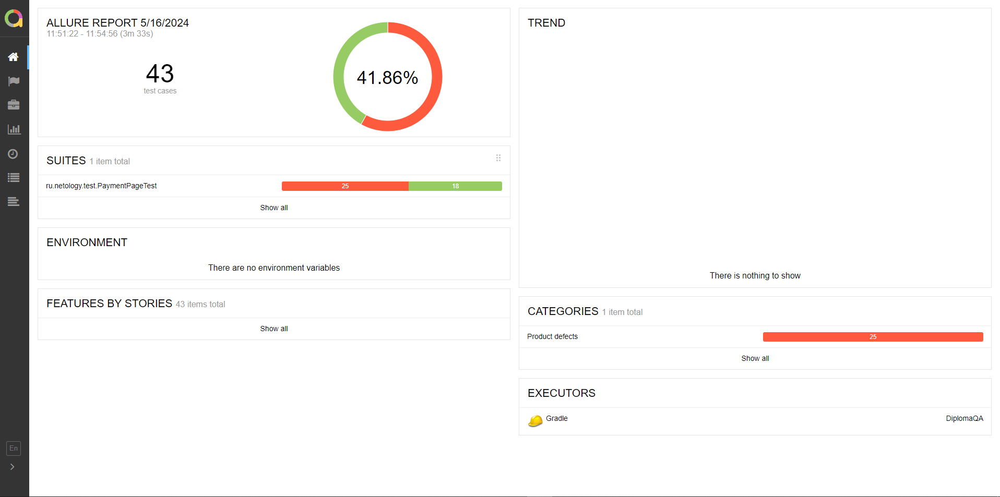

## Отчет по итогам тестирования
Было произведено тестирования веб-сервиса по покупке тура.

В ходе тестирования были реализованы позитивные и негативные сценарии. Всего выполнено 43 тест-кейса:

успешных - 18 (41,86%);

неуспешных - 25 (58,13%).

### Общие рекомендации:
* добавить элементам страницы атрибут test-id;
* исправить дефекты;
* необходима документация, чтобы понять как должно работать приложение.